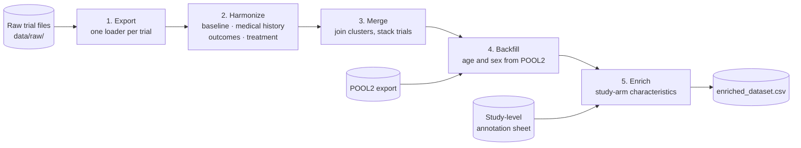

# Collaborative Care Compass 🧭

  

This repository contains the code and documentation for the project "Collaborative Care Compass", developed during the [Data Science for Social Good (DSSG) Summer Fellowship Munich 2026](https://www.dssgxmunich.org/call-for-fellows).

## Project Overview 🌍
 
The project aims to optimise the implementation of Collaborative Care for Depression in German primary care by identifying the most effective combinations of intervention components for specific patient profiles. Leveraging a dataset from the LMU University Hospital, the team analyses how individual treatment elements affect outcomes, to support the effective use of resources and improve patient recovery. The ultimate goal is an intuitive, patient-focused prediction tool, designed in collaboration with general practitioners, that provides data-driven decision support that is both clinically effective and practically sustainable.
 
### Context 📜
 
Depression is one of the most common conditions general practitioners see, and many patients are treated in primary care rather than by specialists. Collaborative care is a well-evidenced way of improving that care: the GP works together with a care manager and a mental health specialist, with structured follow-up of the patient's symptoms. Its effectiveness has been shown in many randomised controlled trials (RCTs).
 
Collaborative care is not a single intervention but a package of components, such as care management, symptom monitoring, specialist supervision, psychological support and medication management. Delivering the full package takes staff time and resources that many practices do not have.
 
### The Challenge 🧩
 
The existing evidence shows that collaborative care works **on average**, but it does not tell a GP which components drive the effect, or which combination is best for the patient in front of them. This project therefore asks which components, alone and in combination, lead to better depression outcomes, and how these effects differ between patients with different profiles, such as baseline severity, age, sex or medical history.
 
Answering these questions requires analysing participant-level data from many trials together. Each trial, however, recorded its data differently, with its own variable names, depression instruments, follow-up schedules and codings, so the data first has to be harmonised into one consistent, pooled dataset. On this basis, the project explores whether an individual patient's likely response to different combinations of components can be predicted, and how such predictions can be presented in a tool that GPs find intuitive and can use within their time and resource constraints.

### Project Goal and Contributions 🚀

The goal of this project is to support personalized collaborative care for depression in German general practice. We contribute in the following ways:

- **Harmonized pooled dataset:** a reproducible pipeline that exports, harmonizes, merges and enriches participant-level data from multiple collaborative care RCTs into one analysis-ready dataset.
- **Clinical prediction model:** a component network meta-analysis (CNMA) and risk-score modelling on the pooled data, to estimate how collaborative care components affect outcomes for different patients.
- **Web prototype:** a prototype tool showing how these insights could be brought into general practice.
- **Documentation:** technical documentation of the data pipeline, modelling approach and suggestions for future work.

## A Note on the Data 🔒

The trial data is confidential participant-level data. It was shared with the team separately and is never committed to this repository. 

## How to Use the Code 🛠️

### Set up the environment

We use [uv](https://docs.astral.sh/uv/getting-started/installation/) to manage Python and dependencies. Once it is installed, run the following command to install any Python dependencies

```bash
git clone https://github.com/DSSGxMunich/collaborative-care-analysis.git
cd collaborative-care-analysis
uv sync
```

### Add the data

Place the raw trial folders in `data/raw/Individual Datasets/` and extract the POOL2 export once:

```bash
unzip data/raw/260810_POOL2.zip -d data/raw/260810_POOL2
```

### Run the pipeline

One command takes every trial from its raw files to a single harmonized dataset:

```bash
uv run collaborative_care_analysis/dataset.py run
```

The result lands in `data/interim/enriched_dataset/enriched_dataset.csv`.

#### How the pipeline works



`run` goes through these steps in order. You can also run each step on its own:

1. **Export** (`export`). Each trial has its own loader in `data_loading/`. The loader reads the raw SPSS, Stata, CSV or Excel file, renames the ID column to `patient_id`, and reshapes the data to long format, with one row per patient per visit and `follow_up_months` giving the time since baseline. The output goes to `data/interim/exported_datasets/`.
2. **Harmonize** (`harmonize`). The trials are mapped onto shared variable names and codings, following [HARMONIZATION_CONVENTIONS.md](HARMONIZATION_CONVENTIONS.md). This is split into four clusters, each in its own `harmonization_*` folder: baseline (age, sex), medical history, outcomes (PHQ-9, GAD-7, SCL-20, …) and treatment (control or intervention arm). Each trial and cluster gives one file in `data/interim/harmonized_datasets/`.
3. **Merge** (`merge`). For each trial, the clusters are joined on `STUDY_ID`, `patient_id` and `follow_up_months`. Then all trials are stacked into one table, and a column that a trial doesn't have is left empty. The merge stops if a join key is missing or duplicated, or if two clusters produce the same column. It warns loudly if the join drops rows. The output is `data/interim/merged_dataset/merged_dataset.csv`.
4. **Backfill** (part of `enrich`). Some trials don't include a usable age or sex. These gaps are filled from the POOL2 export, matched on study and patient ID. Only missing values are filled; existing values are never overwritten.
5. **Enrich** (`enrich`). Each patient is given the characteristics of their study arm from the study-level annotation sheet, for example whether relapse prevention was part of the intervention. These are the `treatment_*` columns. Control arms get "no" for every component.

Some other ways to run it:

```bash
uv run collaborative_care_analysis/dataset.py run 17          # regenerate one trial (by number or name, e.g. Katon_2001)
uv run collaborative_care_analysis/dataset.py run -x 04 -x 17 # rebuild everything except trials 04 and 17
uv run collaborative_care_analysis/dataset.py harmonize 17    # run a single step for a single trial
```

A full run, or a run with `-x`, first clears the old output files, so nothing stale is left behind. The raw data is never modified.

### Running the tests

```bash
uv run pytest
```

Most tests check the pipeline output, so run the pipeline first. Otherwise these tests are skipped.

### Run the notebooks

The notebooks in `notebooks/` cover the cohort filtering and the CNMA model. Open them in Jupyter (`uv run jupyter lab`) or in VS Code with the `.venv` kernel selected.

## Structure of the Repository 📁

```
collaborative-care-analysis/
├── collaborative_care_analysis/   # Source code: data loaders, harmonization, pipeline, analysis
├── data/                          # Raw and processed data (not tracked by git)
├── docs/                          # Technical documentation (MkDocs)
├── models/                        # Fitted models
├── notebooks/                     # Exploration and modelling notebooks
├── tests/                         # Checks on the pipeline output
├── AGENTS.md                      # Data privacy rules
├── HARMONIZATION_CONVENTIONS.md   # How harmonized variables are named and coded
└── pyproject.toml                 # Dependencies and tool configuration
```

## How to Contribute 🤝

1. Create a branch with a descriptive name.
2. Lint and test: `uv run ruff check . --fix && uv run ruff format && uv run pytest`
3. Open a pull request against `main`.

Optionally, `uvx pre-commit install` runs these checks for you on every commit, and `nbstripout --install` keeps notebook outputs out of git.

## Requesting Features or Reporting Bugs 🐞

Found a bug or have an idea? Please open an issue. 
